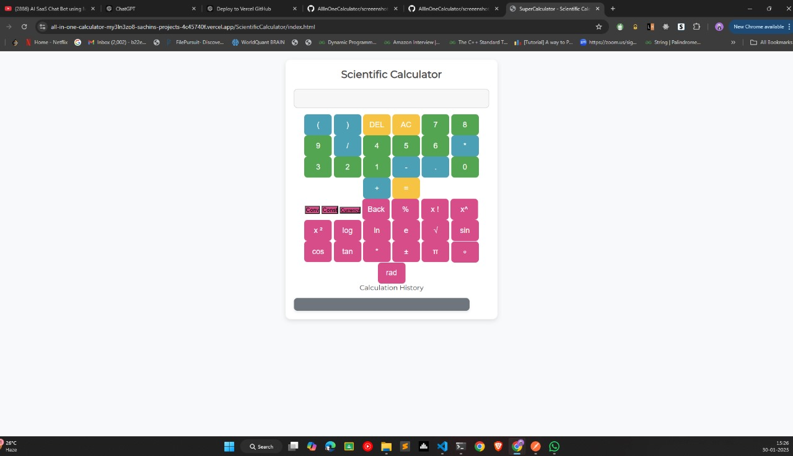
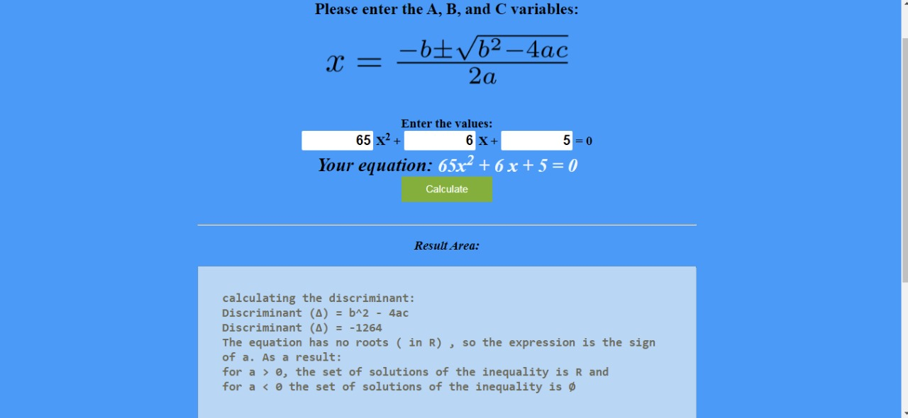
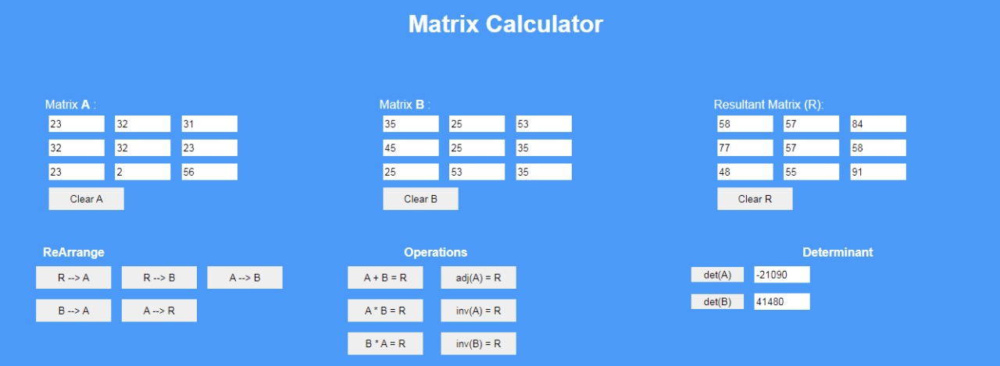
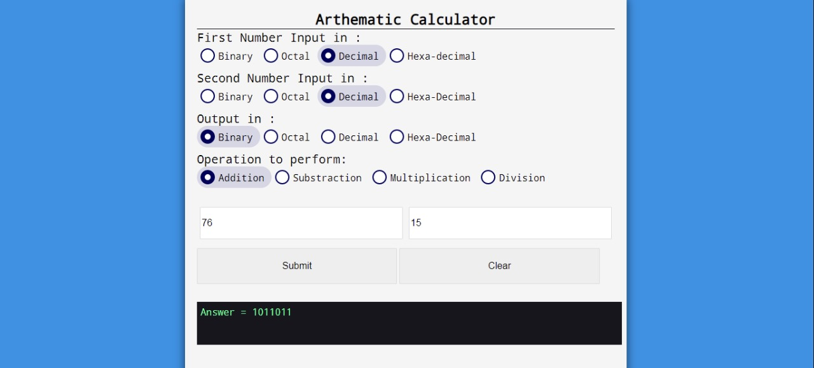
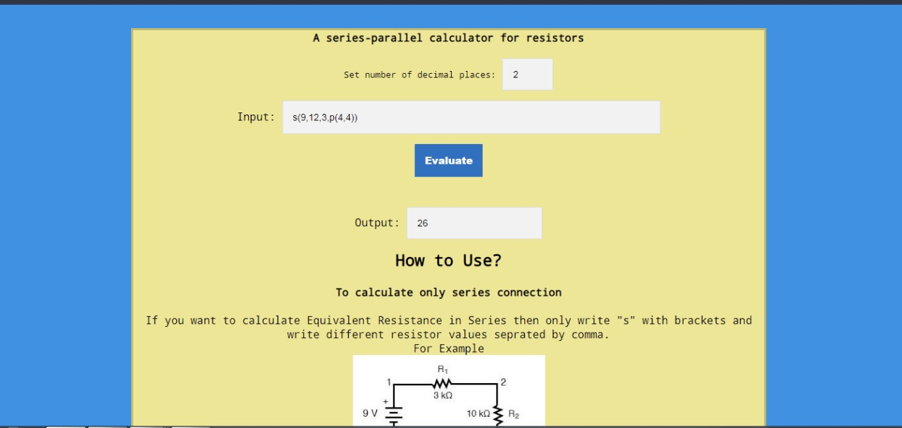
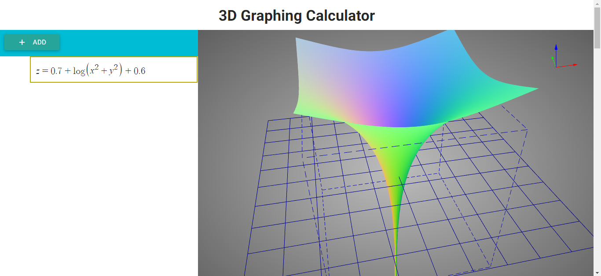

# SuperCalculator - All in one Calculator

SuperCalculator is a collection of 21 different mathematics calculators performing specific calculations, built using HTML, CSS, and Pure JavaScript without any framework or library.

This project is ideal for beginners wanting to learn JavaScript through practical projects. Each calculator implements core logic with minimal code.

# Available Calculators:

## Homepage
A fully responsive dashboard linking to all calculators. Serves as the main `index.html` entry point.

## 1. Scientific Calculator
Features trigonometric functions, logarithms, factorials, history tracking, and physical constants.

## 2. Currency Converter
Real-time exchange rates with clean UI. Uses external API for currency data.

## 3. Live Crypto Rate Tracker
Monitors cryptocurrency prices with 24hr changes and trading volumes.

## 4. Unit Conversion
Convert between 100+ units across categories like acceleration, power, and temperature.

## 5. Password Generator and Checker
Generates secure passwords and evaluates password strength.

## 6. Fraction Calculator
Performs operations with multiple fractions.

## 7. Statistics Calculator
Computes mean, variance, quartiles, and other statistical measures.

## 8. QR Code Scanner and Creator
Generates and reads various QR code types.

## 9. Quadratic Equation Solver
Solves second-order polynomials with discriminant analysis.

## 10. Loan Calculator
Calculates EMI with detailed payment schedules.

## 11. Mortgage Calculator
Advanced loan calculator with tax and insurance considerations.

## 12. Matrix Calculator
Performs matrix operations and determinant calculations.

## 13. Binary Calculator
Handles binary/hex/decimal conversions and operations.

## 14. Age Calculator
Calculates age in multiple time units and counts down to birthdays.

## 15. Love Calculator
Fun compatibility percentage calculator with dynamic UI.

## 16. BMI Calculator
Measures body mass index with body fat estimation.

## 17. Ohm's Law Calculator
Solves electrical parameters using Ohm's Law.

## 18. Equivalent Resistance Calculator
Simplifies complex resistor networks.

## 19. Resistor Color Code Calculator
Decodes resistor bands for 4-6 band resistors.

## 20. 2D Graphing Calculator
Plots functions using Desmos integration.

## 21. 3D Graphing Calculator
Advanced 3D function visualizer (desktop only).

# Technologies Used:
- HTML
- CSS
- JavaScript
- APIs

# Contribution
Contributions are welcome! Please submit issues or feature requests through the repository's issue tracker. Maintain the project's vanilla JavaScript approach and avoid adding frameworks.
